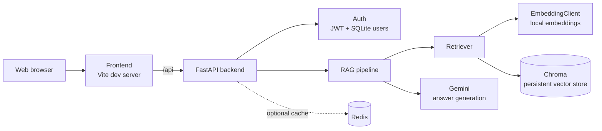

# Ethiopian Cassation RAG

A FastAPI service and web client for asking grounded questions about Ethiopian Federal Supreme Court cassation decisions.

## Overview

The project provides a web client and FastAPI backend for retrieving relevant cassation-decision passages and generating grounded answers with Gemini. Documents are chunked and embedded locally, stored in Chroma, and returned as cited sources alongside the answer.



> **Note:** The supported way to run the project right now is locally, with the backend and frontend started separately (see below). Docker Compose is currently not working; see [Docker Compose](#docker-compose-currently-not-working).

## Requirements

- Python 3.10+ with `pip`
- Node.js and `npm`
- A Gemini API key

## Backend setup (local)

All commands below are for Windows PowerShell, run from the repository root.

1. Create and activate a virtual environment (first time only for creation):

   ```powershell
   python -m venv venv
   Set-ExecutionPolicy -Scope Process -ExecutionPolicy RemoteSigned
   .\venv\Scripts\Activate.ps1
   ```

   `Set-ExecutionPolicy -Scope Process` only affects the current terminal window, so repeat it each time you open a new PowerShell session. When activation succeeds, your prompt starts with `(venv)`.

2. Install the backend requirements (first time only):

   ```powershell
   pip install -r backend/requirements.txt
   ```

3. Create the environment file:

   ```powershell
   cd backend
   copy .env.example .env
   cd ..
   ```

   Set a valid `GEMINI_API_KEY` and a strong, private `JWT_SECRET_KEY` in `backend/.env`. Never commit `.env` or real credentials. Any key that has been exposed must be revoked and replaced through the provider.

4. Start the API **from the repository root** (not from inside `backend/`):

   ```powershell
   uvicorn backend.app.main:app --reload
   ```

   On startup the backend loads the embedding model and the vector store once. This can take a little while the first time. A healthy start looks like this:

   ```text
   INFO:     Uvicorn running on http://127.0.0.1:8000 (Press CTRL+C to quit)
   INFO:     Waiting for application startup.
   Loading embedder + vector store (one-time)...
     -> vector store has 2731 chunks
   INFO:     Application startup complete.
   ```

   The chunk count shown depends on the documents you have ingested.

The API is available at `http://localhost:8000`; health is checked at `/api/v1/health` and interactive documentation is at `/docs`.

## Frontend setup (local)

Open a **second** terminal, activate nothing extra (the frontend does not need the Python environment), and run:

```powershell
cd frontend
npm install     # first time only
npm run dev
```

Vite starts the development server at `http://localhost:5173/`. Open that address in your browser. Keep the backend running in the other terminal, because the frontend sends its requests to the API at `http://localhost:8000`.

## Running the full app

| Terminal | Directory | Command | URL |
|----------|-----------|---------|-----|
| 1 (backend) | repository root, `(venv)` active | `uvicorn backend.app.main:app --reload` | http://localhost:8000 |
| 2 (frontend) | `frontend/` | `npm run dev` | http://localhost:5173 |

Once both are running, the frontend loads the document list and your saved conversations from the backend (`/api/v1/documents`, `/api/v1/chat/conversations`) and you can start asking questions.


## Troubleshooting

- **`uvicorn` is not recognized:** the virtual environment is not active. Run the activation command from the backend setup again.
- **Running scripts is disabled (PowerShell):** run `Set-ExecutionPolicy -Scope Process -ExecutionPolicy RemoteSigned` in the same window, then activate again.
- **`ModuleNotFoundError: backend`:** you started `uvicorn` from the wrong directory. Run it from the repository root.
- **Answers fail or return errors:** check that `GEMINI_API_KEY` is set correctly in `backend/.env`.
- **Frontend loads but shows no data:** confirm the backend is running at `http://localhost:8000` and that `/api/v1/health` responds.

## Docker Compose (currently not working)

The repository contains a `docker-compose.yml` (backend on port 8000, frontend on port 5173, Redis cache, and a `backend_data` volume for SQLite and Chroma), but **the Docker setup does not currently work**. Please use the local setup above until this is fixed.

```powershell
docker compose up --build   # not currently working
```

## Deployment

The deployment workflow runs on pushes to `main`, waits for backend and frontend CI, and publishes both images to GHCR. The provider-specific deployment step remains a disabled placeholder and requires deployment secrets before activation. Because the Docker setup is not currently working, treat the image build and deployment workflow as unverified until Docker is fixed.
