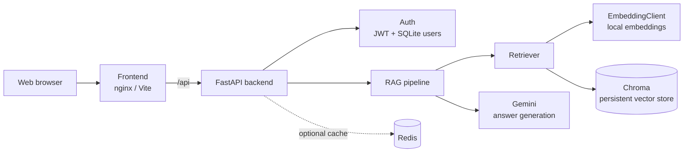

# Ethiopian Cassation RAG

A FastAPI service and web client for asking grounded questions about Ethiopian Federal Supreme Court cassation decisions.

## Overview

The project provides a web client and FastAPI backend for retrieving relevant cassation-decision passages and generating grounded answers with Gemini. Documents are chunked and embedded locally, stored in Chroma, and returned as cited sources alongside the answer.



In production, the frontend and backend are built as separate containers. Chroma and SQLite use the backend data volume; Redis is available as the cache service for components that adopt it.

## Backend setup

```bash
cd backend
cp .env.example .env
```

Set a valid `GEMINI_API_KEY` and a strong, private `AUTH_SECRET_KEY` in `backend/.env`. Never commit `.env` or real credentials. Any key that has been exposed must be revoked and replaced through the provider.

Run the API from the repository root:

```bash
uvicorn backend.app.main:app --reload
```

The API is available at `http://localhost:8000`; health is checked at `/api/v1/health` and interactive documentation is at `/docs`.

## Authentication

The Person 4 authentication module provides register, login, and current-user handlers in `backend/app/api/v1/endpoints/auth.py`. The current implementation uses an in-memory repository for local development until the database adapter is connected. It must not be used as production persistence.

The endpoint module still needs to be included by the owner of `backend/app/api/v1/router.py`:

```python
from backend.app.api.v1.endpoints import auth
api_router.include_router(auth.router, prefix="/auth", tags=["auth"])
```

## Tests

Install the backend requirements and pytest, then run:

```bash
python3 -m pytest backend/tests -q
```

The tests mock or avoid external model and vector-store calls. They do not require a Gemini credential.

## Docker Compose

Create `backend/.env` first, then run:

```bash
docker compose up --build
```

The backend listens on port 8000 and the frontend on port 5173. The vector database is stored in the named `vector_data` volume.

## Deployment

The deployment workflow is intentionally provider-neutral and manual. It validates the repository before deployment and expects provider-specific commands and credentials to be configured as GitHub Environment secrets.
