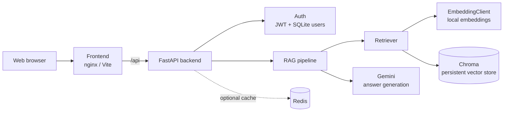

# Ethiopian Cassation RAG

A FastAPI service and web client for asking grounded questions about Ethiopian Federal Supreme Court cassation decisions.

## Overview

The project provides a web client and FastAPI backend for retrieving relevant cassation-decision passages and generating grounded answers with Gemini. Documents are chunked and embedded locally, stored in Chroma, and returned as cited sources alongside the answer.



In production, the frontend and backend are built as separate containers. Chroma and SQLite use the backend data volume; Redis is available as the cache service for components that adopt it.

## Backend setup

```bash
cd backend
cp .env.example .env
```

Set a valid `GEMINI_API_KEY` and a strong, private `JWT_SECRET_KEY` in `backend/.env`. Never commit `.env` or real credentials. Any key that has been exposed must be revoked and replaced through the provider.

Run the API from the repository root:

```bash
uvicorn backend.app.main:app --reload
```

The API is available at `http://localhost:8000`; health is checked at `/api/v1/health` and interactive documentation is at `/docs`.

## Authentication

The authentication module provides database-backed register, login, and current-user handlers in `backend/app/api/v1/endpoints/auth.py`. Bearer tokens are issued by `/api/v1/auth/login` and required by `/api/v1/auth/me`.

## Tests

Install the backend requirements and pytest, then run:

```bash
python3 -m pytest backend/tests -q
```

The tests mock or avoid external model and vector-store calls. They do not require a Gemini credential.

## Docker Compose

Create `backend/.env` first, then run:

```bash
docker compose up --build
```

The backend listens on port 8000 and the frontend on port 5173. SQLite and the local Chroma vector store are stored in the named `backend_data` volume; Redis uses `redis_data`.

## Deployment

The deployment workflow runs on pushes to `main`, waits for backend and frontend CI, and publishes both images to GHCR. The provider-specific deployment step remains a disabled placeholder and requires deployment secrets before activation.
